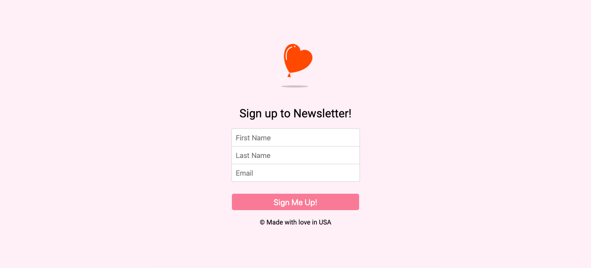
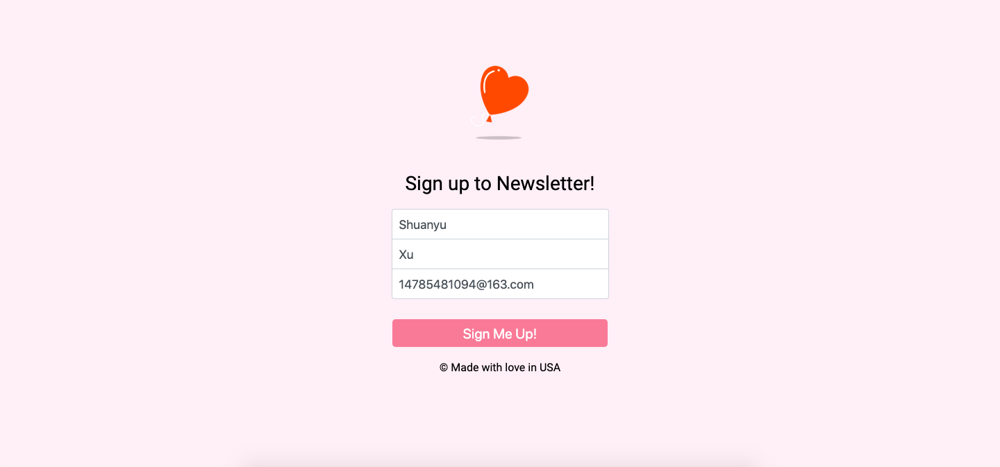
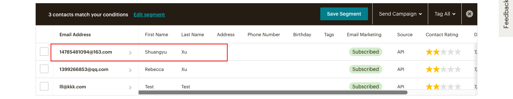
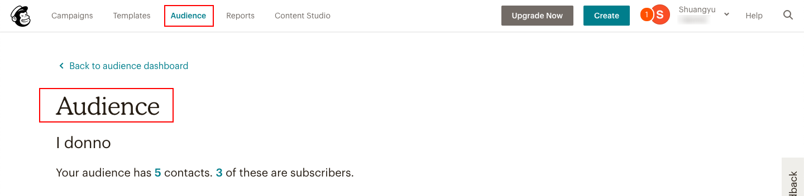
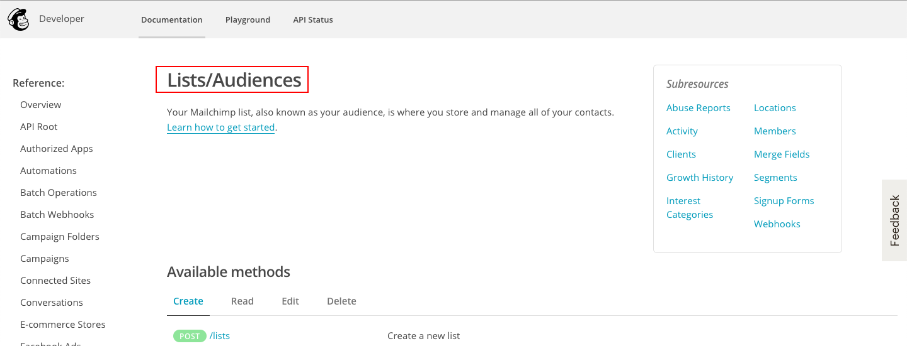
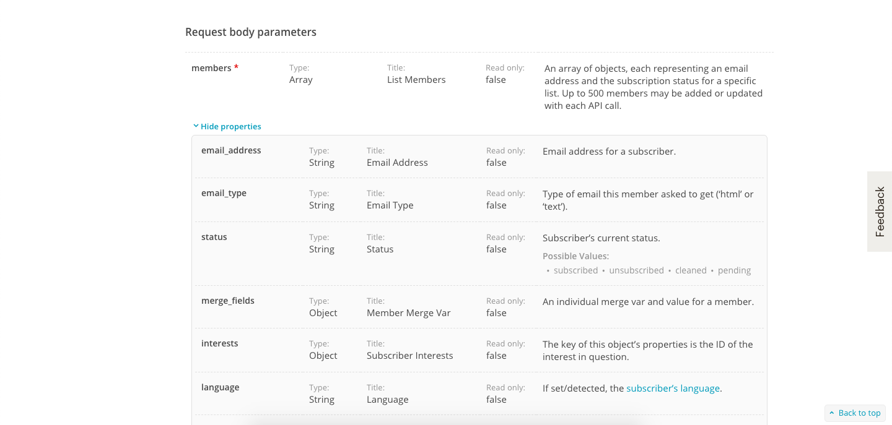
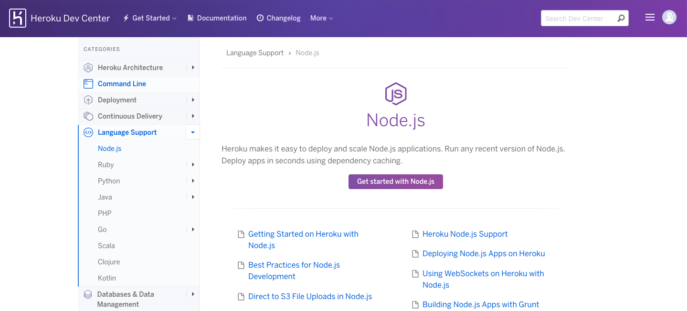
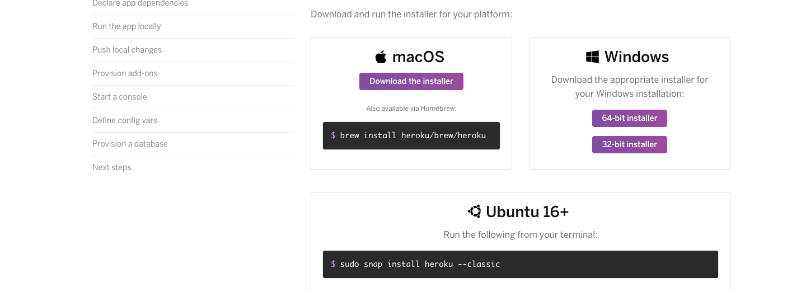

# newsletter-signup
A simple sign-up application using chimpmail &amp; heroku

# Sign-up application

:point_right: [Click me to see the example!](https://enigmatic-mesa-41567.herokuapp.com/) :point_left:

<h4>content</h4>

- [主要功能展示](#main-function)
- [核心关键步骤](#core-step)
    - [chimpmail-API](#chimpAPI)
    - [heroku托管](#heroku)
- [应用方向](#apply)

---

<h4 id="main-function">主要功能展示</h4>

##### sign up界面

##### 输入相关信息

##### 成功提交

##### 在chimpmail账户中会出现一条刚才输入的信息

##### 若提交失败，出现失败界面，点击"再次尝试"返回sign up界面


---

<h4 id="core-step">核心关键步骤</h4>
<h5 id="chimpAPI">chimpmail-API</h5>
&#8195;&#8195;为了将用户提交的信息同步至chimpmail中，需要调用其相关API (https://developer.mailchimp.com/) 。比较常规的，首先设置request的第一个参数options，包含需调用API的网址（url），调用方法（method）为POST。



&#8195;&#8195;我们将会使用chimpmail的audience功能，在开发者文档中找到list/audiences一栏，进入查看"Batch sub/unsub list members"API调用方法。




&#8195;&#8195;样例使用中的是curl方法，在命令行中实现，我们将使用的是request方法，在服务器上实现，两者在方法使用上会有一些不同，但是总体的思路还是一致的，比如我们依然需要url告诉服务器请求的是哪个网址，需要APIkey来对操作进行授权，需要传送相应的数据等等。

&#8195;&#8195;首先，需要对样例中url中的部分内容进行替换，替换后的通式为
```
https://us{{x}}.api.mailchimp.com/3.0/lists/{{list-id}}
```
&#8195;&#8195;其中{{x}}为邮箱APIkey的最后两位或者一位数字（代表用户所属数据服务器）。

&#8195;&#8195;其次，将method参数的默认值“GET”改为“POST”， 这是因为我们想将数据上传到其服务器上，所以方法应改为上传。紧接着对我们的操作用mail账户APIkey进行授权（授权所需数据格式需要和官方文档一致）。最后，用body参数传入用户输入的数据（数据用JSON格式）。
注：数据格式需要与文档介绍一致



```js
var firstName = req.body.firstName;
var lastName = req.body.lastName;
var email = req.body.email;

var data = {
    members: [{
        email_address: email,
        status: "subscribed",
        merge_fields: {
            FNAME: firstName,
            LNAME: lastName
        }
    }]
}

var jsonData = JSON.stringify(data);

var options = {
    url: "https://us{{x}}.api.mailchimp.com/3.0/lists/{{list-id}}",
    method: "POST",
    headers: {
    "Authorization": "{{name}} {{API-keys}}"
    },
    body: jsonData
};

request(options, function(error, response, body){...});
```
&#8195;&#8195;至此，我们只能实现在本地上传数据到chimpmail中去，如果想让我们的家人，朋友，客户也使用这个应用，该怎么办呢？下一个步骤就是将我们本地应用服务端托管到网上服务端中去。Heroku 是 Salesforce 旗下云服务商，提供方便便捷的各种云服务，如服务器，数据库，监控，计算等等，并且它提供了少量项目的免费托管服务（需要科学上网），同时其也是本次项目选择的托管方。

<h5 id="heroku">heroku托管</h5>


1. Set up

&#8195;&#8195;同样的，需要注册相关账号，打开官方的参考文档，选择对应项目语言的教程，开始一步一步进行项目托管。

&#8195;&#8195;首先，根据自己电脑型号下载对应最新版本的heroku。

&#8195;&#8195;从命令行进入项目文件夹中，使用命令根据提示进行登入   
```
$ heroku login
heroku: Press any key to open up the browser to login or q to exit: 
Opening browser to https://cli-auth.heroku.com/auth/browser/a351c734-593c-4dba-a8c8-355b6660f093
Logging in... done
Logged in as 1399266853xsyy@gmail.com
```
&#8195;&#8195;接着检查自己的npm，node，git版本是否符合相关要求，若不符合，需要进行相关的升级操作，若没有安装，则需首先进行相应的环境配置。
```
$ node -v
v10.16.0

$ npm -v
6.10.2

$ git --version
git version 2.20.1 (Apple Git-117)
```
2. Prepare the app
   
&#8195;&#8195;对项目进行初始化。我们的项目目前是运行在本地上自定义port的服务端上，heroku不一定会想要使用我们定好的端口，所以需要将之前的app.listen( )方法的第一个参数进行一定的调整，从
```js
app.listen(8080, function () {
    console.log("The server is running on port 8080.");
 });
```
变为
```js
app.listen(process.env.PORT || 8080, function () {
    console.log("The server is running on heroku & port 8080.");
 });
```
这样，我们不仅可以在本地服务端上运行此应用，还可以在网络服务端上运行它。
&#8195;&#8195;然后，根据文档，建立Procfile文件，告诉heroku我们应用的启动js文件是什么。
```
$ touch Procfile
$ open Procfile
```
在Profile文件中写入：
```
web: node app.js
```
&#8195;&#8195;最后，就是将我们的应用保存在git中，方便对应用版本的控制与选择。

```
$ git init
Initialized empty Git repository in /Users/xushuangyu/Desktop/Sign-up/.git/
$ git add .
$ git commit -m "First commit"
[master (root-commit) 64c1046] First commit
 Committer: Rebecca Xu <xushuangyu@MacBook-Air.local>
Your name and email address were configured automatically ...
```
然后，把此应用通过heroku上传
```
$ heroku create
Creating app... done, ⬢ stark-mesa-56915
https://stark-mesa-56915.herokuapp.com/ | https://git.heroku.com/stark-mesa-56915.git
```
生成的网址就是托管在heroku上的项目地址（可以分享给朋友），候着是项目github存放地址。
```
$ git push heroku master
```
稍等几分钟，项目就托管好啦！可以去访问看效果了！

:exclamation:如果需要对项目进行更改的话，可用以下方法进行：
```
$ git add .
$ git commit -m "..."
$ git push heroku master
```
---
<h5 id="apply">应用方向</h5>
有的公司如果有订阅栏目的话，可以用此方法收集用户信息，利用chimpmail平台具有可方便群发邮件的功能，定时为用户提供订阅消息。

###### July 29，2019
